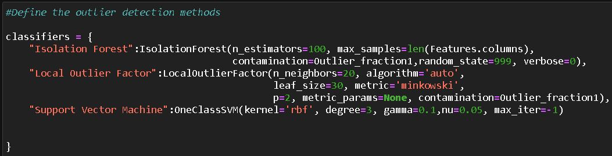
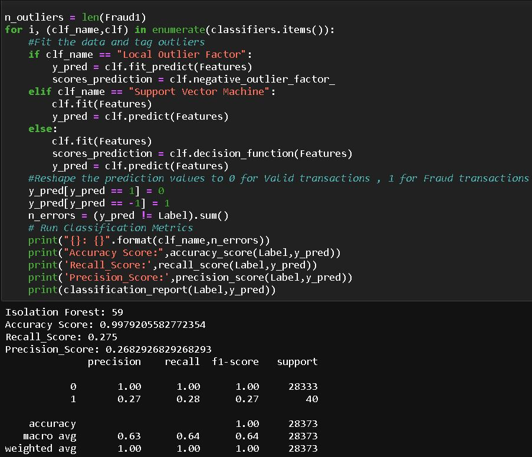
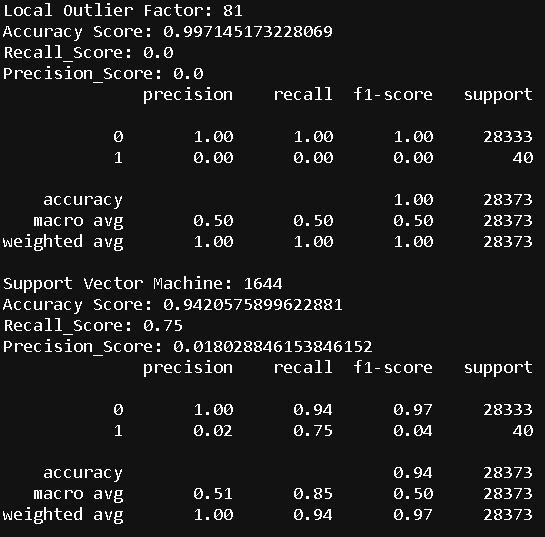

# Credit-Card-Fraud-Detection-IsolationForest-One-Class-SVM-Local-Outlier-Factor
Python Data Science Project, Bank Loan Credit Risk Prediction using:

- IsoLationForest (90.30 % Accuracy)
- Local Outlier Factor (89.28 % Accuracy)
- Support Vector Machine (89.8%)

For other Accuracy Details Please Check the Project. Other Accuracy Criterias are AUC & ROC Curve, Confusion Matrix, Classification Report, recall_score, precision_score etc.

## Problem Statement
Credit risk is nothing but the default in payment of any loan by the borrower. In Banking sector this is an important factor to be considered before approving the loan of an applicant. Based on the Customer Data Features Bank will decide to approve the Loan or not.
In this challenge, we have to build a predictive model that answers the question: “what sorts of Applicants should be approved for the Loan?” using Applicant's data Features (ie Employ, Address, Creddebt, debtinc, Othdebt etc).

## Project Overview
In this Project I have unleashed the useful Data Science insights using this Bank_Loan dataset and performed the feature selection, feature engineering & missing data handling precisely to build Classification models. In this project I have used 8 types of Classification Algorithms which are Logistic Regression, KNN, KMeans, Support Vector Machine, Decision Tree, Random Forest, Ada-Boost-Classifier, Gradient-Boosting-Classifier. 8 Algorithms along with combining the power of best statistical rules & principles to maximise accuracy at its best followed by all statistical conditions. The best thing is my model is not having any Multicollinearity Problem. All features are fulfilling Statistically Significant concept respect to the target variable.

## This Project is divided into 54 major steps which are as follows:
1. [Check out the Data](#data-check)
2. [Importing Libraries & setting up environment](#imp-lib)
3. [Loading dataset](#data-load)
4. [Normality Check of Continuous Variables/Features](#norm-check)
5. [Treating Missing Values & Feature Engineering](#miss-val)
6. [Dropping Features after Feature Engineering](#drop-feature)
7. [Redo Feature Engineering](#redo-feature)
8. [Again Drop unwanted Features](#again-drop)
9. [Check & Drop Duplicate Rows](#drop-dupli)
10. [Exploratory Data Analysis ( EDA )](#data-expo)
11. [Measures Of Association between Categorical Variables](#cate-asso)
12. [Measures Of Association between Categorical & Continuous Variables](#cate-continu)
13. [Saving The Processed Data](#save-data)
14. [Correlation/Association Check using Phik](#corr-check)
15. [Feature Selection/Removal](#feature-removal)
16. [Encoding Features](#feature-removal)
17. [Train & Test Split Selection (Logistic Regression)](#train-split)
18. [Multi-Colinearity Check](#multi-check)
19. [Final Implmentation of Titanic Logistic Regression](#final-model)
20. [Logistic Regression Results](#log-result)
21. [Confusion Matrix (with & without Normalization)](#conf-norm)
22. [ROC Curve (Logistic Regression)](#ROC-Curve)
23. [Precision Recall Curve (Logistic Regression)](#Recall-Curve)
24. [Logistic Regression Tuning](#Log-Tuning)
26. [Hyperparameter Tuning Manually](#Manual-Tuning)
27. [Manual Tuning Result](#Manual-Result)
28. [Log Loss Result of Manual Tuning](#LogLoss-Result)
29. [Solver Selection Process](#Solver-Selection)
30. [Hyperparameter Tuning by using LogisticRegressionCV](#Tuning-LogisticRegressionCV)
31. [LogisticRegressionCV Tuning Result](#Tuning-Result)
31. [LogisticRegressionCV Tuning Log_Loss Result](#Loss-Result)
32. [Hyperparameter Tuning by using GridSearchCV](#Tuning-GridSearchCV)
33. [Logistic Regression GridSearchCV Tuning Result](#Result-GridSearchCV)
25. [Logistic Regression Tuning Result](#Log-TuningResult)
26. [K Nearest Neighbour Clustering](#K-NN)
26. [K Means Clustering](#K-Means)
26. [Support Vector Machine (Titanic)](#Titanic-SVM)
27. [SVM Results](#SVM-Result)
28. [Loan SVM Confusion Matrix (With & Without Normalization)](#SVM-Matrix)
29. [SVM ROC Curve for Titanic](#SVM-ROC)
30. [SVM Precision Recall Curve for Titanic](#SVM-Precision)
31. [Support Vector Machine Tuning](#SVM-Tuning)
32. [SVM Tuning Result (recall_score, precision_score, classification_report)](#SVM-TuneResult)
33. [Decision Tree](#Decision-Tree)
33. [Prunning of Decision Tree](#Decision-Tree)
34. [Decision Tree Result (classification_report, confusion_matrix, recall_score, precision_score)](#Decision-Result)
35. [Visualizing Decision Tree](#Viz-Tree)
36. [Decision Tree Tuning](#Tree-Tuning)
37. [Random Forest](#Random-Forest)
38. [Visualizing Random Forest Tree](#Viz-Tree)
39. [ADA-Boost Forest/Stumps Forest Classifier](#ADA-Boost)
40. [ADA-Boost Forest/Stumps Forest Classifier Hyperparametre Tuning](#ADA-Boost)
41. [GradientBoostingClassifier](#Gradient-Boosting)
43. [GradientBoostingClassifier Hyperparameter Tuning](#Gradient-Tune)

## Selected Features
From the Bank_Loan DataSet, Statistically Significant Selected Features are as follows:

- 'EMPLOY' - A Feature of an Applicant

- 'ADDRESS' - A Feature of an Applicant

- 'DEBTINC' - A Feature of an Applicant

- 'CREDDEBT' - A Feature of an Applicant
